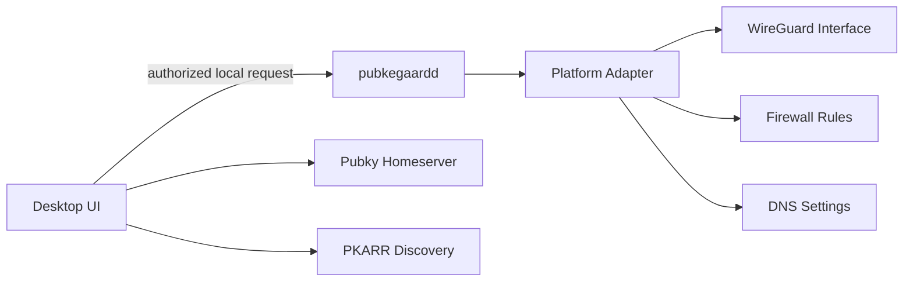

# Pubkegaard Desktop Specification

## Goal

Pubkegaard Desktop is the non-technical interface for a trusted-peer WireGuard network coordinated through Pubky identity, PKARR discovery, and Pubkegaard policy. A user must be able to install the app, create or authorize the required keys, add Pubky identities as peers, grant specific network capabilities, revoke access, and stop risky network modes without using the CLI.

## Canonical Sources

The desktop app follows implemented Pubky SDK, PKARR, and Pubky URI behavior. Local drafts for Pubky crypto, unified delegation, Paykit, or Noise bindings remain research context unless the same behavior exists in implemented libraries.

## Key Roles

Pubkegaard uses separate keys for separate jobs:

- Pubky root identity key anchors the owner identity and authorizes operational bindings.
- PKARR-bound `pubky-noise` control key signs or authenticates Pubkegaard device/control records.
- WireGuard device key is used only by WireGuard for packet transport.
- Homeserver session token authorizes reads/writes under `/pub/pubkegaard/`.

The root identity key should not be required for normal tunnel operation. It is used for onboarding, recovery, revocation, and control-key binding.

## Discovery Record

Each local device publishes a device record through the owner discovery document. The record includes:

- Device label and identifier.
- `pubky-noise` control public key.
- WireGuard public key.
- Reachable endpoints.
- Overlay addresses.
- Advertised capabilities.
- Routes the device is willing to serve.

Peers must treat the WireGuard key as transport material only. Pubky identity and the bound control key determine whether that WireGuard key belongs to an authorized Pubkegaard device.

## Desktop Responsibilities

The desktop UI owns user intent and local app state. It must not directly mutate WireGuard, firewall, DNS, or route state. Privileged network changes are requested through `pubkegaardd`.

The desktop app must provide:

- Onboarding for key creation/import and optional Pubky Ring homeserver session authorization.
- Peer management by Pubky identity.
- Policy presets for mesh, relay, exit, and LAN sharing.
- Network status for direct, relayed, degraded, and stopped states.
- Emergency stop while relay, exit, or LAN sharing is active.
- Key backup, rotation, and device revocation.
- Platform setup and permission guidance for macOS, Windows, and Linux.

## Desktop To Daemon Boundary

The UI communicates with a local authorized daemon API. The daemon is the only process that can apply network state.

## Release Criteria

Desktop alpha is not releasable until the app can create a local device record, persist peers, plan a Linux mesh configuration, revoke a peer, and show the emergency stop path. Relay and exit UI may be present only behind explicit disabled/gated states until their release gates pass.
